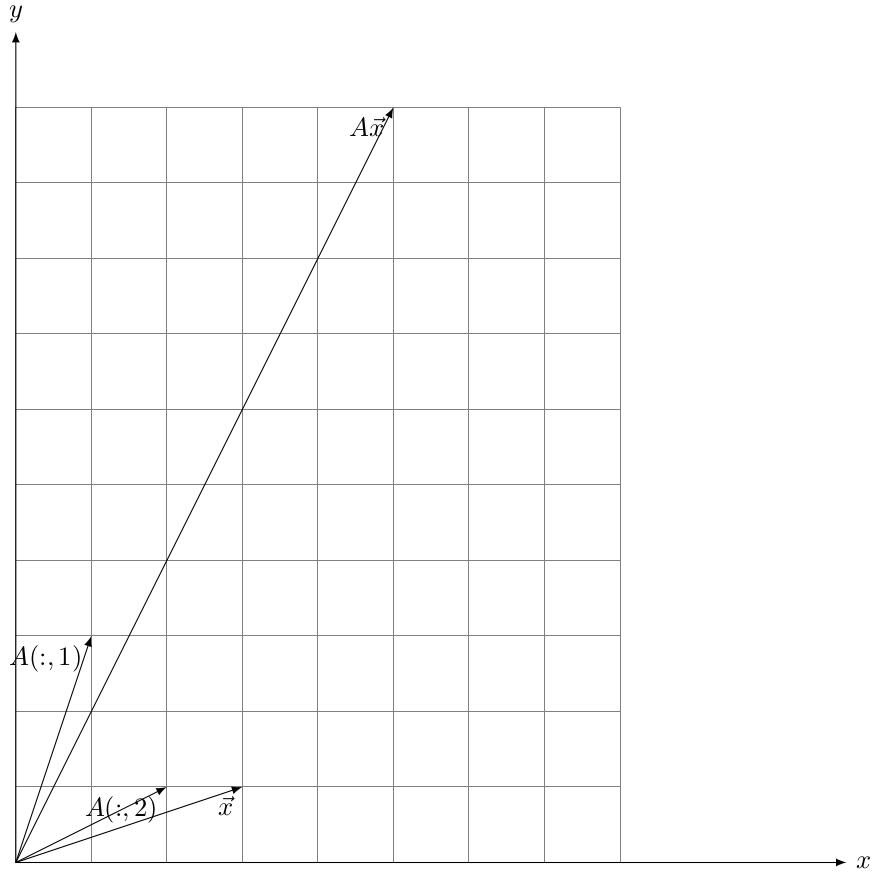

## 1.2$A\vec{x}=\vec{b}$的四种视角

&emsp;&emsp;除了1.1节给出的简化表达式$A\vec{x}=\vec{b}$，还能怎么简化呢？因为1.1简化得过于厉害，我们都似乎不知道该怎么计算这个线性方程组了。我们按照提取公共部分的想法，你看$x_{1}，x_{2}，x_{3}$在方程组里重复书写了好几次，按照这样的想法，我们可以把方程组简写成:  

$$
x_1\begin{bmatrix} a_{11}\\ a_{21}\\a_{31}\end{bmatrix} + x_2\begin{bmatrix}a_{12}\\a_{22}\\a_{23}\end{bmatrix} + x_3\begin{bmatrix}a_{13}\\ a_{23}\\a_{33}\end{bmatrix}=\begin{bmatrix}b_1\\b_2\\b_3\end{bmatrix}
$$

&emsp;&emsp;我们很容易看出这个表达式的意思，根据它进行计算，并且我们能从这个式子发现一些有趣的想法，等式左边是矩阵$A$的列[^矩阵的列的表示]的线性组合，系数是$x_{1}，x_{2}，x_{3}$

#### 有三种代数视角

###### 视角一:以$\vec{b}$为中心  

&emsp;&emsp;等式表达的是，向量$\vec{b}$是$A$的列的组合的产物，如果能找到组合系数$\vec{x}$，那么该线性方程组有解，可以为$\vec{x}$  

###### 视角二:以$A$为中心  

&emsp;&emsp;先只看左边$A\vec{x}=x_{1}\begin{bmatrix}{a_{11}}\\ {a_{21}}\\{a_{31}}\end{bmatrix} + x_{2}\begin{bmatrix}{a_{12}}\\{a_{22}}\\{a_{23}}\end{bmatrix} + x_{3}\begin{bmatrix}{a_{13}}\\ {a_{23}}\\{a_{33}}\end{bmatrix}$，当$\vec{x}$取任意值，那么有无穷多个$A\vec{x}$的值，那么这个结果集合我们称作$A$的列空间，记作$C(A)$(Column Space of $A$)  

&emsp;&emsp;因为是列的组合的结果集，所以叫做列空间，而不是其他什么空间。空间比结果集更好听，且有几何的意味。这里$A$的每一列都是3x1的矩阵，也就是向量。有列空间，当然也有行空间，但是这里暂时不讨论，需要的时候再讨论。如果$\vec{b}$在$C(A)$里，那么该方程组有解。  

###### 视角三:以$\vec{x}$为中心  

&emsp;&emsp;$A\vec{x}=\vec{b}$好像是函数表达式，$A$操作$\vec{x}$得到$\vec{b}$。若看成$f(\vec{x})=\vec{b}$，那么输入$\vec{x}$，输出$\vec{b}$，函数关系$A$。可以把$A$理解为操作。另外向量本身是具有几何的意味，那么向量$\vec{x}$到向量$\vec{b}$的函数可以称作向量的几何变换。在代数上，$A\vec{x}=\vec{b}$是$A$把$\vec{x}$映射成$\vec{b}$  

###### 视角四:矩阵的本质是坐标系变换  

&emsp;&emsp;我们想问$\vec{x}$是如何变换到$\vec{b}$的? 自然是通过$A$作用于$\vec{x}$得到$\vec{b}$。但是太抽象了，我们需要仔细挖掘一下具体是怎么变换的。那么看看$x_{1}\begin{bmatrix}{a_{11}}\\ {a_{21}}\\{a_{31}}\end{bmatrix} + x_{2}\begin{bmatrix}{a_{12}}\\{a_{22}}\\{a_{23}}\end{bmatrix} + x_{3}\begin{bmatrix}{a_{13}}\\ {a_{23}}\\{a_{33}}\end{bmatrix}=\begin{bmatrix}{b_{1}}\\{b_{2}}\\{b_{3}}\end{bmatrix}$吧，这具体了一些，但是依旧很抽象，我们换成具体的数好了。写个二元一次的例子叭。  

$$
\begin{bmatrix}1&0\\0&1\end{bmatrix} \begin{bmatrix}x\\y\end{bmatrix} =x\begin{bmatrix}1\\0\end{bmatrix}+y\begin{bmatrix}0\\1\end{bmatrix}=\begin{bmatrix}x\\y\end{bmatrix}
$$  

&emsp;&emsp;我们可以看出来这个矩阵很特殊，作用是啥也不干，是恒等变换。如果换成$\begin{bmatrix}2&0\\0&2\end{bmatrix}$，那么是把$\vec{x}$的长度扩长为原长度的2倍。一般的，矩阵$\begin{bmatrix}c&0\\0&c\end{bmatrix}$表示伸缩变换，扩长为原长度的$c$倍。  

&emsp;&emsp;如果看看下面这个矩阵呢？  

$$\begin{bmatrix}1&2\\3&1\end{bmatrix}$$
&emsp;&emsp;则$A\vec{x}=\begin{bmatrix}x+2y\\3x+y\end{bmatrix}$，这好像很难看出什么几何意义了，我们画画图试试看，并且给$\vec{x}$赋值为$(3,1)$。  

&emsp;&emsp;图中$A\vec{x}，\vec{x}，A(:，1)，A(:，2)$似乎也看不出什么关系，但若结合线性组合看看
$$3\begin{bmatrix}1\\3\end{bmatrix} + 1\begin{bmatrix}2\\1\end{bmatrix} = \begin{bmatrix}5\\10\end{bmatrix}$$

&emsp;&emsp;答案似乎呼之欲出了，但可能还是有些模糊，看看$\begin{bmatrix}2&0\\0&2\end{bmatrix} \begin{bmatrix}3\\1\end{bmatrix} = 3\begin{bmatrix}2\\0\end{bmatrix}+1\begin{bmatrix}0\\2\end{bmatrix}=\begin{bmatrix}6\\2\end{bmatrix}$

&emsp;&emsp;这两个矩阵方程有什么共同点呢？很明显，他们的系数$\vec{x}$是一样的，不同的是$A$的列不一样。其实答案已经出来了，只是我们习惯了平面直角坐标系，我们画的图都是基于平面直角坐标系的，这样就很不容易看出来了。我们认为坐标$\vec{x}$的是一样的，但是我们又知道他们是不一样的，因为坐标系不一样。对于图一，它的新的坐标系是由$\begin{bmatrix}1\\3\end{bmatrix}与\begin{bmatrix}2\\1\end{bmatrix}$构成的，看看，如果我们把$\begin{bmatrix}1\\3\end{bmatrix}$当作"x轴"的基向量，$\begin{bmatrix}2\\1\end{bmatrix}$当作"y轴"的基向量，那么$P$点在新坐标系下的坐标为$\begin{bmatrix}3\\1\end{bmatrix}$，而在平面直角坐标系$\begin{bmatrix}1\\0\end{bmatrix}$与$\begin{bmatrix}0\\1\end{bmatrix}$下的坐标为$\begin{bmatrix}5\\10\end{bmatrix}$

#### 小结:三种代数视角与几何视角的关系  

###### 视角一与几何视角  

&emsp;&emsp;$\sum$$x_{i}A(:,i)$即$A$的列的线性组合，系数是$x_{i}$，那么新坐标系下点的坐标为$x_{i}$，新坐标系由$A(:,i)$充当基向量来构成。

###### 视角二与几何视角  

&emsp;&emsp;$A$的列空间$C(A)$由新坐标系的基$A(:,i)$组合而成。$C(A)$有多大，新坐标系的范围就有多大。

###### 视角三与几何视角  

&emsp;&emsp;$A\vec{x}=\vec{b}$即$f(\vec{x})=\vec{b}$可以看成是对标准基向量(例如$\begin{bmatrix}1\\0\end{bmatrix}$)组成的直角坐标系进行坐标系变换。变换前后，点在各自坐标系下的坐标是相同的，如果换算坐标系，那么新坐标系下的坐标在旧坐标系下的坐标与原坐标不一样，除非是恒等变换。

[^矩阵的列的表示]:采用matlab里矩阵各行各列的表示，例如$A(:，i)$表示第i列，$A(i，:)$表是第i行
